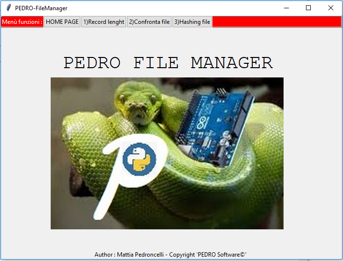

✓ Author: Mattia Pedroncelli© - Date: 2019  mattia.pedroncelli@gmail.com
  
# GUI FILE MANAGER
### GUI per la gestione di varie funzionalità sui file

La GUI nella HOME PAGE mostra nel Menù in alto le funzioni disponibili da effettuare sui file.
o script mostra a video il timing rimanente (ORE, MINUTI, SECONDI) dall'orario attuale rispetto all'orario impostato per il calcolo del countdown.   
La GUI è eseguibile da un file .exe **PEDRO-FileManager.exe** generata dallo script python.
 
  
  
Selezionando dal menù la funzione desiderata si accede al pannello della funzione. 

**Funzioni disponibili**

> "VERIFICA LUNGHEZZA RECORD : verifica se un file contiene dei record più lunghi di una determinata lunghezza da parametrizzare."  
> "CONFRONTA FILE : confronta il contenuto di due file (uguale o diverso)."  
> "HASHING FILE : genera la stringa hash (SHA256) del contenuto di un file."
